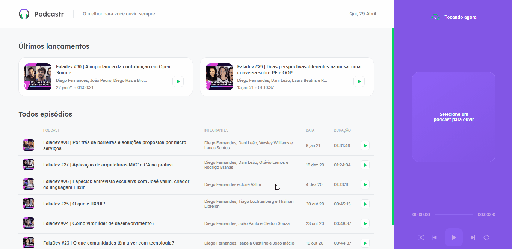

<h1 align="center" title="Podcastr">
		
		Podcastr
</h1>

<h2 align="center">Podcastr is a platform for listening to podcasts about development 🚀</h2>

<h4 align="center">
 <a href="#-features-developed-during-the-course">💻 Features</a> •
 <a href="#-technologies-used">🛠 Technologies</a> • 
 <a href="#-how-to-run-the-project">🔨 How to run the project</a> • 
 <a href="#star2-thanks">:star2: Thanks</a> • 
 <a href="#books-references">:books: References</a> 
</h4>

<br>



<h2 align="center"> 
	<a href="https://podcastr-tl-lucasestevam.vercel.app/">View Demo</a>
</h2>

## 💻 Features developed during the course

- [x] Play, Pause, Repeat, Next, Previous, Shuffle
- [x] Statistics page for each episode
- [x] Slider
- [x] Highlight for the last 2 episodes
- [x] List of episodes consuming a JSON API

## 🛠 Technologies Used

- [React](https://pt-br.reactjs.org/)
- [TypeScript](https://www.typescriptlang.org/)
- [Next.js](https://nextjs.org/docs)
- [Sass](https://sass-lang.com/documentation)

## 🔨 How to run the project

```bash
# Clone this repository
$ git clone https://github.com/tl-lucasestevam/podcastr.git

# Access the project folder
$ cd podcastr

# Install the dependencies
$ yarn install

# Run the json server to emulate the api
$ yarn server

# Run the application in development mode
$ yarn dev

```

## **:star2: Thanks!**

<div align=center>

<table style="width:100%">
  <tr align=center>
    <td>
      <a href="https://nextlevelweek.com/">
        
      </a>
			<p>
				Next Level Week
			</p>
    </td>
    <td>
      <a href="https://rocketseat.com.br/">
        
      </a>
			<p>
				Rocketseat
			</p>
    </td>
    <td>
      <a href="https://github.com/diego3g">
        
      </a>
			<p>
				Diego3g
			</p>
    </td>
  </tr>
</table>

</div>

## **:books: References**

- [Deploying with Json-Server](https://dev.to/nikita_guliaev/deploying-create-react-app-with-json-server-as-backend-to-github-3pp9)

<h4 align="center">
	Make with ❤️ by <a href="https://github.com/tl-lucasestevam">Lucas Estevam</a>
</h4>
