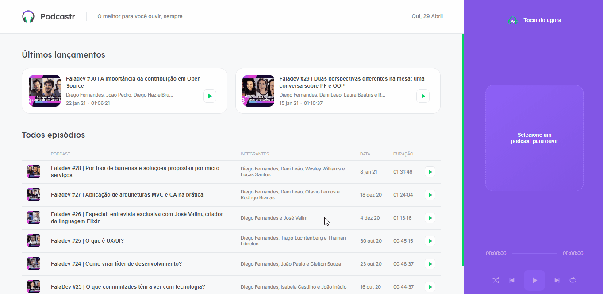

<h1 align="center" title="Podcastr">
		
		Podcastr
</h1>

<h2 align="center">Podcastr is a platform for listening to podcasts about development 🚀</h2>

<h3 align="center">
 <a href="##additional-features">✨ Features</a> •
 <a href="##-🛠-technologies-used">🛠 Technologies</a> • 
 <a href="##-🔨-how-to-run-the-project">🔨 How to run the project</a> • 
 <a href="##:star2:-thanks!**">:star2: Thanks</a> • 
 <a href="##-📝-License">📝 License</a>
</h3>

<br>

[](http://github.com/tl-lucasestevam/podcastr/LICENSE)

[](https://www.codacy.com/manual/tl-lucasestevam/podcastr?utm_source=github.com&utm_medium=referral&utm_content=jvictorfarias/GoBarber&utm_campaign=Badge_Grade)

[](http://commitizen.github.io/cz-cli/)

<br>



<br>

<h2 align="center"> 
	🚧  Podcastr 🚀 In construction...  🚧
</h2>

## ✨ Additional Features

- [ ] PWA
- [ ] Theme Switcher
- [ ] Language Switcher
- [ ] Responsive
- [x] Progress bar when loading

## 💻 Features developed during the course

- [x] Play, Pause, Repeat, Next, Previous, Shuffle
- [x] Statistics page for each episode
- [x] Slider
- [x] Highlight for the last 2 episodes
- [x] List of episodes consuming a JSON API

## 🛠 Technologies Used

- [Node.js](https://nodejs.org/en/)
- [Axios](https://github.com/axios/axios)
- [React](https://pt-br.reactjs.org/)
- [TypeScript](https://www.typescriptlang.org/)
- [Next.js](https://nextjs.org/docs)
- [Sass](https://sass-lang.com/documentation)

## 🔨 How to run the project

```bash
# Clone this repository
$ git clone https://github.com/tl-lucasestevam/podcastr.git

# Access the project folder
$ cd podcastr

# Install the dependencies
$ yarn install

# Run the json server to emulate the api
$ yarn server

# Run the application in development mode
$ yarn dev

```

## **:star2: Thanks!**

<div align=center>

<table style="width:100%">
  <tr align=center>
    <td>
      <a href="https://nextlevelweek.com/">
        
      </a>
			<p>
				Next Level Week
			</p>
    </td>
    <td>
      <a href="https://rocketseat.com.br/">
        
      </a>
			<p>
				Rocketseat
			</p>
    </td>
    <td>
      <a href="https://github.com/diego3g">
        
      </a>
			<p>
				Diego3g
			</p>
    </td>
  </tr>
</table>

</div>

<!--
## **:books: REFERÊNCIAS**

- [React + TypeScript Cheat Sheet](https://github.com/typescript-cheatsheets/react-typescript-cheatsheet)
- [Blog Rocketseat](https://blog.rocketseat.com.br/)
- [ReactJS](https://reactjs.org/docs/getting-started.html) | [ReactJS pt-BR](https://pt-br.reactjs.org/docs/getting-started.html)
- --->

## 📝 License

This repository is licensed by **MIT LICENSE**. For more detailed information, read the file [LICENSE](./LICENSE) contained in this repository.

<h3 align="center">
	Make with ❤️ by <a href="https://github.com/tl-lucasestevam">Lucas Estevam</a>
	<br><br>
	<a href="https://rocketseat.com.br">
		
	</a>
</h3>
